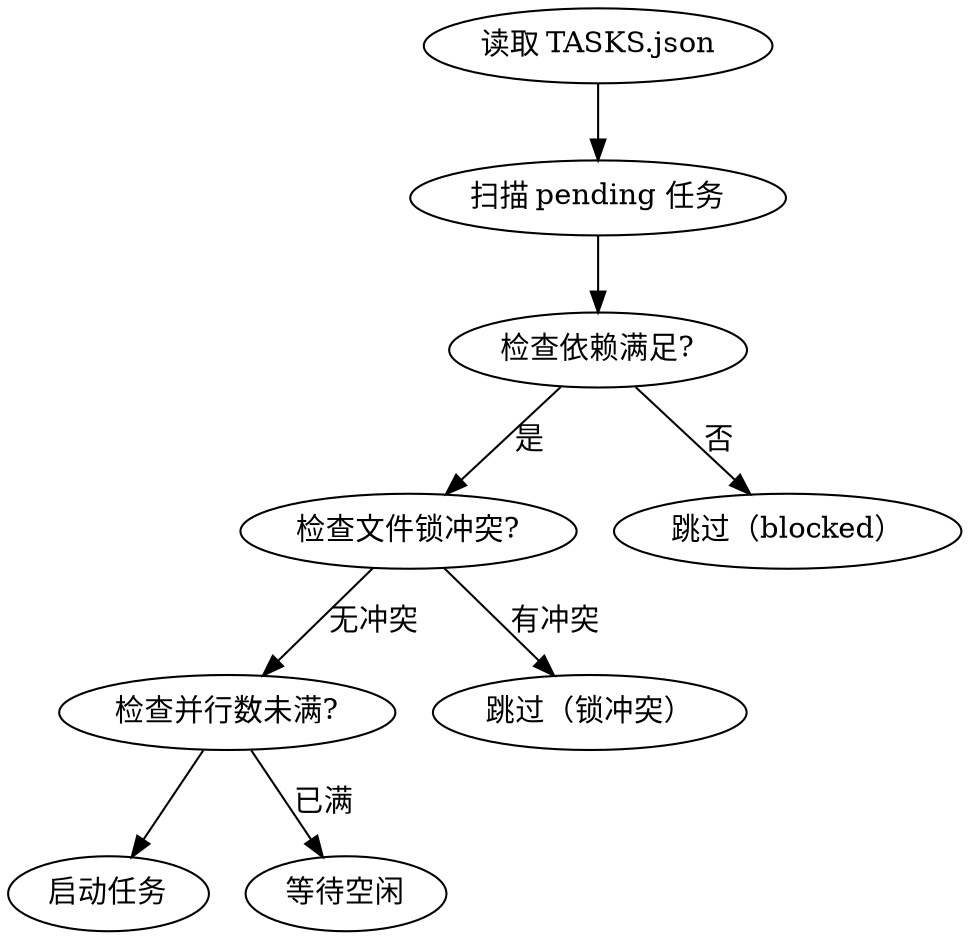

# Multi-Agent Task Dispatcher

> 持久化任务状态 + DAG 依赖 + 结构化摘要 = 模型不降智

## 核心目标

- **上下文干净**：子 agent 只看到最小输入
- **任务约束明确**：结构化 task 定义
- **结果可验证**：质量门禁
- **失败可恢复**：checkpoint + 重试

## 触发条件

- 用户说"开始执行"、"执行计划"、"dispatch tasks"
- TASKS.json 存在且有 pending 任务
- 上下文使用率 > 70%

## 文件结构

```
project/
├── .dispatcher/
│   ├── TASKS.json              # 任务状态机（所有状态在这里）
│   ├── SUMMARY/                # 子 agent 返回的摘要
│   ├── CACHE/                  # 结果缓存（加速重跑）
│   └── LOGS/                   # 审计日志
├── docs/plans/                 # 计划文件（触发点）
└── src/                        # 实际代码
```

## 任务状态机

```
pending → running → completed/verified
                    ↘ failed → retry (最多 3 次)
                              → blocked (依赖失败)
                              → fatal (需要人工介入)
```

### 状态流转关键规则

| 状态 | 含义 | 流转条件 |
|------|------|----------|
| `pending` | 待执行 | 依赖全部完成 |
| `running` | 执行中 | 启动子 agent |
| `completed` | 已完成 | 子 agent 返回成功 |
| `verified` | 已验证 | Master 质量检查通过 |
| `failed` | 失败 | 子 agent 返回错误 |
| `blocked` | 阻塞 | 依赖任务失败 |
| `fatal` | 致命 | 重试超过上限或致命错误 |

## 调度算法

### 并行扫描

```python
def get_runnable_tasks(tasks, max_parallel):
    # 1. 过滤 status == "pending"
    # 2. 检查所有 depends_on 是否 completed/verified
    # 3. 检查 file_locks 不冲突
    # 4. 按 priority 排序
    # 5. 取前 max_parallel 个
```

### 调度流程



## 快速参考

### 初始化任务队列

```bash
mkdir -p .dispatcher/SUMMARY .dispatcher/CACHE .dispatcher/LOGS
cat > .dispatcher/TASKS.json << 'EOF'
{
  "version": "1.0",
  "created_at": "$(date -u +%Y-%m-%dT%H:%M:%SZ)",
  "scheduler": {
    "max_parallel": 3,
    "retry_policy": { "max_attempts": 3, "backoff_seconds": [5, 25, 125] }
  },
  "tasks": [
    {"id": "T1", "description": "...", "status": "pending", "depends_on": []}
  ]
}
EOF
```

### 启动任务

```bash
jq "(.tasks[] | select(.id == \"T4-2\") | .status) = \"running\" |
    (.tasks[] | select(.id == \"T4-2\") | .started_at) = \"$(date -u +%Y-%m-%dT%H:%M:%SZ)\"" \
  .dispatcher/TASKS.json > tmp.json && mv tmp.json .dispatcher/TASKS.json
```

### 完成任务

```bash
jq "(.tasks[] | select(.id == \"$TASK_ID\") | .status) = \"completed\" |
    (.tasks[] | select(.id == \"$TASK_ID\") | .completed_at) = \"$(date -u +%Y-%m-%dT%H:%M:%SZ)\" |
    (.tasks[] | select(.id == \"$TASK_ID\") | .summary_file) = \"SUMMARY/$TASK_ID.json\"" \
  .dispatcher/TASKS.json > tmp.json && mv tmp.json .dispatcher/TASKS.json
```

### 扫描可运行任务

```bash
jq '[.tasks[] | select(.status == "pending") | select(
  [.tasks[] | select(.id == .depends_on[]).status] | all(. == "completed" or . == "verified")
)]' .dispatcher/TASKS.json
```

## 失败恢复策略

| 错误类型 | 处理方式 |
|----------|----------|
| `retryable` | 指数退避重试（5s → 25s → 125s） |
| `fatal` | 标记 fatal，停止调度，通知人工 |
| `blocked` | 依赖项失败，等待依赖解决后自动重试 |

### Checkpoint 机制

每个任务完成后写入：
1. `SUMMARY/{task_id}.json` - 结果摘要
2. `CACHE/{task_id}_hash.json` - 输入 hash
3. 更新 `TASKS.json` 中任务状态

重跑时：
1. 计算当前输入 hash
2. 对比缓存 hash
3. 相同 → 直接返回缓存结果

## 质量验证

### 验证时机

```
子 Agent 完成 → Master 检查 → 通过 → 标记 verified
                              → 失败 → 触发重试或人工介入
```

### 验证内容

1. **结构验证**：summary.json 格式正确
2. **产物验证**：artifacts 文件存在且非空
3. **逻辑验证**：(可选) 运行 lint/test
4. **一致性验证**：检查依赖的任务是否匹配

## 文件锁机制

防止并行任务同时写同一文件：

```json
{
  "file_locks": {
    "src/auth/login.ts": "T4-2",
    "src/auth/styles.css": "T4-2"
  }
}
```

调度前检查：
- 新任务的 artifacts 与现有锁冲突 → 不能并行
- 任务完成后自动释放锁

## 常见错误

| 错误 | 原因 | 解决 |
|------|------|------|
| `cyclic_dependency` | 任务依赖形成环 | 检查 depends_on 字段 |
| `file_lock_conflict` | 两个任务写同一文件 | 拆分任务或串行化 |
| `context_overflow` | 上下文超过限制 | 减少 max_parallel |
| `orphan_task` | 依赖任务不存在 | 检查 depends_on ID |
| `missing_summary` | 任务完成但无摘要 | 修复子 agent 输出格式 |

## 模板文件

- `master-prompt.md` - Master Agent 调度逻辑
- `sub-prompt.md` - Sub Agent 执行规范
- `TASKS.schema.json` - TASKS.json 完整 Schema

---

*Multi-Agent Dispatcher v1.0 | 2026-04-23*
